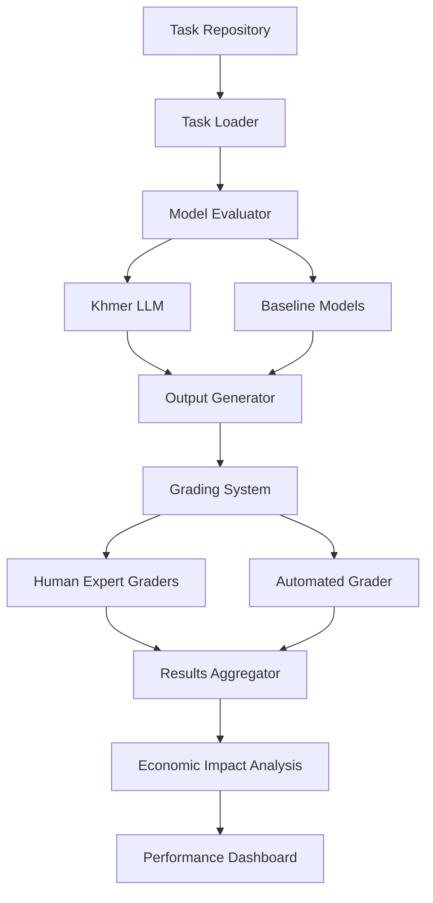

# GDPval: Economic Value-Driven Evaluation Framework for Khmer Language Models

## 🎯 Executive Summary

GDPval (GDP-based Validation) is a groundbreaking evaluation framework that measures AI model performance on real-world, economically valuable tasks. This repository implements GDPval specifically for Khmer language models, adapting OpenAI's methodology to evaluate LLMs on tasks drawn from Cambodia's key economic sectors.

**Key Innovation**: Unlike traditional benchmarks that focus on academic metrics, GDPval evaluates models on actual work products from 44 occupations across 9 GDP-contributing industries, with specialized adaptation for Khmer language and Southeast Asian economic contexts.

## 📊 Framework Overview

### Core Statistics
- **1,320 total tasks** (220 in gold open-source set)
- **44 occupations** across 9 major industries
- **14+ years** average professional experience of task creators
- **Multi-modal evaluation** supporting 11+ file types
- **Economic impact measurement** with ROI calculations

### Why GDPval for Khmer Models?

Traditional evaluations fail to capture real-world applicability in emerging markets. GDPval-Khmer addresses:
- **Language-specific challenges**: Khmer script complexity, limited digital resources
- **Regional economic relevance**: Tasks from Cambodia's GDP drivers
- **Cultural context**: Locally relevant business scenarios
- **Multi-lingual reality**: Code-switching between Khmer, English, and Chinese

## 🏗️ Architecture



## 📁 Repository Structure

```
gdpval-khmer/
├── README.md                       # This file
├── SETUP.md                        # Detailed setup instructions
├── LICENSE                         # Apache 2.0
├── requirements.txt                # Python dependencies
├── environment.yml                 # Conda environment
├── .env.example                   # Environment variables template
│
├── data/
│   ├── tasks/
│   │   ├── gold_set/             # 220 open-source tasks
│   │   │   ├── finance/          # Financial sector tasks
│   │   │   ├── healthcare/       # Healthcare tasks
│   │   │   ├── technology/       # Tech industry tasks
│   │   │   ├── agriculture/      # Agricultural tasks (Cambodia-specific)
│   │   │   ├── tourism/          # Tourism tasks (Cambodia-specific)
│   │   │   └── manufacturing/    # Manufacturing tasks
│   │   ├── full_set/             # Complete 1,320 tasks
│   │   └── khmer_specific/       # Khmer-language specific tasks
│   ├── reference_files/          # Supporting documents
│   ├── expert_solutions/         # Ground truth solutions
│   └── grading_rubrics/         # Evaluation criteria
│
├── src/
│   ├── __init__.py
│   ├── core/
│   │   ├── task_loader.py       # Task loading and management
│   │   ├── evaluator.py         # Model evaluation logic
│   │   ├── grader.py            # Grading systems
│   │   └── orchestrator.py      # Evaluation orchestration
│   ├── models/
│   │   ├── base_model.py        # Abstract model interface
│   │   ├── khmer_model.py       # Khmer LLM implementation
│   │   ├── openai_model.py      # OpenAI baseline
│   │   └── anthropic_model.py   # Claude baseline
│   ├── tasks/
│   │   ├── task_schema.py       # Task data structures
│   │   ├── task_generator.py    # Task creation tools
│   │   └── task_validator.py    # Task validation
│   ├── grading/
│   │   ├── human_grading.py     # Human expert interface
│   │   ├── automated_grading.py # LLM-as-judge system
│   │   └── metrics.py           # Scoring metrics
│   ├── analysis/
│   │   ├── performance.py       # Performance analysis
│   │   ├── economic_impact.py   # Economic calculations
│   │   └── visualization.py     # Results visualization
│   └── utils/
│       ├── file_handlers.py     # Multi-modal file processing
│       ├── khmer_utils.py       # Khmer text processing
│       └── logging_config.py    # Logging configuration
│
├── scripts/
│   ├── run_evaluation.py        # Main evaluation script
│   ├── create_tasks.py          # Task creation utility
│   ├── analyze_results.py       # Results analysis
│   └── export_metrics.py        # Export for papers/reports
│
├── notebooks/
│   ├── 01_data_exploration.ipynb
│   ├── 02_model_comparison.ipynb
│   ├── 03_economic_analysis.ipynb
│   └── 04_khmer_specific_analysis.ipynb
│
├── tests/
│   ├── test_task_loader.py
│   ├── test_evaluator.py
│   ├── test_grader.py
│   └── test_khmer_utils.py
│
├── configs/
│   ├── model_configs.yaml       # Model configurations
│   ├── task_configs.yaml        # Task parameters
│   └── grading_configs.yaml     # Grading settings
│
├── results/
│   ├── evaluations/             # Evaluation outputs
│   ├── grades/                  # Grading results
│   └── reports/                 # Generated reports
│
└── docs/
    ├── API.md                   # API documentation
    ├── TASKS.md                 # Task creation guide
    ├── GRADING.md              # Grading methodology
    └── CONTRIBUTING.md         # Contribution guidelines
```

## 🚀 Quick Start

### Prerequisites

```bash
# System requirements
- Python 3.9+
- CUDA 11.8+ (for GPU acceleration)
- 32GB RAM minimum
- 100GB storage for full dataset

# Khmer language support
- Khmer fonts installed
- ICU library for text processing
```

### Installation

```bash
# Clone repository
git clone https://github.com/your-org/gdpval-khmer.git
cd gdpval-khmer

# Create conda environment
conda env create -f environment.yml
conda activate gdpval-khmer

# Install dependencies
pip install -r requirements.txt

# Install Khmer NLP tools
pip install khmer-nltk pykhmer

# Download evaluation data
python scripts/download_data.py --dataset gold_set

# Configure environment
cp .env.example .env
# Edit .env with your API keys
```

### Basic Usage

```python
from gdpval_khmer import GDPvalEvaluator, KhmerModel

# Initialize evaluator
evaluator = GDPvalEvaluator(
    data_dir="data/tasks/gold_set",
    output_dir="results/evaluations"
)

# Load your fine-tuned Khmer model
khmer_model = KhmerModel(
    model_path="path/to/your/khmer_model",
    tokenizer_path="path/to/tokenizer"
)

# Run evaluation
results = evaluator.evaluate(
    model=khmer_model,
    task_categories=["finance", "healthcare", "technology"],
    use_human_grading=False,  # Start with automated grading
    parallel_tasks=True
)

# Analyze results
from gdpval_khmer.analysis import PerformanceAnalyzer

analyzer = PerformanceAnalyzer(results)
report = analyzer.generate_report(
    include_economic_impact=True,
    compare_with_baselines=True
)

print(report.summary)
```

## 📋 Task Structure

### Task Schema

```json
{
  "task_id": "FIN-KH-001",
  "occupation": "Financial Analyst",
  "category": "finance",
  "industry": "Banking and Financial Services",
  "gdp_contribution_percent": 8.5,
  "task_metadata": {
    "language": "khmer",
    "difficulty_level": 3,
    "estimated_time_minutes": 45,
    "wage_per_hour_usd": 25,
    "required_expertise": ["financial_modeling", "khmer_regulations"]
  },
  "prompt": {
    "instruction": "វិភាគរបាយការណ៍ហិរញ្ញវត្ថុត្រីមាសទី៣...",
    "instruction_english": "Analyze Q3 financial report...",
    "context": "អ្នកជាអ្នកវិភាគហិរញ្ញវត្ថុនៅធនាគារជាតិ...",
    "output_format": "structured_report",
    "output_language": "khmer_primary_english_technical"
  },
  "reference_files": [
    {
      "file_id": "ref_001",
      "file_name": "q3_financial_statement.xlsx",
      "file_type": "spreadsheet",
      "description": "Q3 2024 Financial Statement",
      "language": "khmer_english_mixed"
    },
    {
      "file_id": "ref_002",
      "file_name": "nbc_regulations_2024.pdf",
      "file_type": "pdf",
      "description": "National Bank of Cambodia Regulations",
      "language": "khmer"
    }
  ],
  "grading_criteria": [
    {
      "criterion": "accuracy",
      "weight": 0.3,
      "description": "Correctness of financial calculations"
    },
    {
      "criterion": "regulatory_compliance",
      "weight": 0.25,
      "description": "Adherence to NBC regulations"
    },
    {
      "criterion": "language_quality",
      "weight": 0.2,
      "description": "Proper use of Khmer financial terminology"
    },
    {
      "criterion": "insight_depth",
      "weight": 0.25,
      "description": "Quality of analysis and recommendations"
    }
  ],
  "expert_solution": {
    "file_path": "expert_solutions/FIN-KH-001_solution.pdf",
    "completion_time_minutes": 38,
    "expert_id": "expert_012",
    "expert_years_experience": 15
  }
}
```

## 🔧 Implementation Details

### 1. Task Loading System

```python
class KhmerTaskLoader:
    """Specialized task loader for Khmer language tasks"""
    
    def __init__(self, data_dir: str, language_filter: str = "khmer"):
        self.data_dir = Path(data_dir)
        self.language_filter = language_filter
        self.khmer_processor = KhmerTextProcessor()
        
    def load_tasks(self, categories: List[str] = None) -> List[Task]:
        """Load and validate Khmer language tasks"""
        tasks = []
        
        for task_file in self.data_dir.glob("**/*.json"):
            with open(task_file, 'r', encoding='utf-8') as f:
                task_data = json.load(f)
            
            # Validate Khmer text
            if not self.khmer_processor.validate_text(task_data['prompt']['instruction']):
                logger.warning(f"Invalid Khmer text in task {task_data['task_id']}")
                continue
            
            # Process reference files
            reference_files = self._load_reference_files(task_data['reference_files'])
            
            task = Task(
                task_id=task_data['task_id'],
                occupation=task_data['occupation'],
                category=task_data['category'],
                prompt=self._process_prompt(task_data['prompt']),
                reference_files=reference_files,
                grading_criteria=task_data['grading_criteria'],
                expert_solution=task_data.get('expert_solution')
            )
            
            tasks.append(task)
        
        return tasks
```

### 2. Model Evaluation Pipeline

```python
class KhmerModelEvaluator:
    """Evaluator for Khmer language models"""
    
    async def evaluate_task(self, model: KhmerModel, task: Task) -> TaskResult:
        """Evaluate a single task with Khmer model"""
        
        # Prepare context with proper encoding
        context = self._prepare_multilingual_context(task)
        
        # Handle code-switching scenarios
        if task.requires_code_switching:
            context = self._add_language_hints(context, task.expected_languages)
        
        # Generate response
        start_time = time.time()
        
        try:
            response = await model.generate(
                prompt=context,
                max_tokens=task.max_output_tokens,
                temperature=0.1,  # Lower for professional tasks
                language_hint="khmer_primary"
            )
            
            # Post-process Khmer text
            response = self.khmer_processor.post_process(response)
            
            execution_time = time.time() - start_time
            
            return TaskResult(
                task_id=task.task_id,
                model_output=response,
                execution_time=execution_time,
                success=True,
                language_quality_score=self._assess_language_quality(response)
            )
            
        except Exception as e:
            logger.error(f"Evaluation failed for task {task.task_id}: {str(e)}")
            return TaskResult(
                task_id=task.task_id,
                success=False,
                error=str(e)
            )
```

### 3. Grading System

```python
class BilingualGrader:
    """Grading system supporting Khmer-English evaluation"""
    
    def __init__(self, grader_model: str = "gpt-4", khmer_experts: List[str] = None):
        self.grader_model = grader_model
        self.khmer_experts = khmer_experts or []
        self.translation_service = KhmerTranslator()
    
    async def grade_pairwise(
        self, 
        task: Task, 
        output_a: str, 
        output_b: str,
        use_human_expert: bool = False
    ) -> PairwiseGrade:
        """Perform pairwise comparison with bilingual support"""
        
        if use_human_expert and self.khmer_experts:
            return await self._human_expert_grade(task, output_a, output_b)
        
        # Automated grading with translation for consistency
        grading_prompt = self._create_bilingual_grading_prompt(
            task, output_a, output_b
        )
        
        judgment = await self._get_model_judgment(grading_prompt)
        
        return PairwiseGrade(
            winner=judgment['winner'],
            confidence=judgment['confidence'],
            explanation=judgment['explanation'],
            language_scores={
                'a': judgment['language_score_a'],
                'b': judgment['language_score_b']
            }
        )
```

### 4. Economic Impact Analysis

```python
class CambodianEconomicAnalyzer:
    """Economic impact analysis for Cambodian context"""
    
    def __init__(self, wage_data_path: str):
        self.wage_data = pd.read_csv(wage_data_path)
        self.exchange_rate = self.get_current_exchange_rate()
    
    def calculate_economic_impact(
        self, 
        task_results: List[TaskResult],
        task_metadata: List[Dict]
    ) -> EconomicImpact:
        """Calculate economic impact in Cambodian context"""
        
        impacts = []
        
        for result, metadata in zip(task_results, task_metadata):
            # Get local wage for occupation
            hourly_wage_khr = self.wage_data.loc[
                self.wage_data['occupation'] == metadata['occupation'],
                'hourly_wage_khr'
            ].iloc[0]
            
            hourly_wage_usd = hourly_wage_khr / self.exchange_rate
            
            # Calculate savings
            human_time_hours = metadata['estimated_time_minutes'] / 60
            ai_time_hours = result.execution_time / 3600
            
            time_saved_hours = human_time_hours - ai_time_hours
            cost_saved_usd = time_saved_hours * hourly_wage_usd
            
            # Adjust for accuracy
            if result.accuracy_score:
                cost_saved_usd *= result.accuracy_score
            
            impacts.append({
                'task_id': result.task_id,
                'time_saved_hours': time_saved_hours,
                'cost_saved_usd': cost_saved_usd,
                'cost_saved_khr': cost_saved_usd * self.exchange_rate,
                'productivity_gain_percent': (time_saved_hours / human_time_hours) * 100,
                'sector': metadata['category'],
                'gdp_impact_basis_points': self._calculate_gdp_impact(
                    cost_saved_usd, 
                    metadata['category']
                )
            })
        
        return EconomicImpact(impacts)
```

## 📊 Evaluation Metrics

### Core Metrics

| Metric | Description | Formula | Target |
|--------|-------------|---------|--------|
| **Task Success Rate** | Percentage of tasks completed successfully | `successful_tasks / total_tasks` | > 95% |
| **Win Rate** | Pairwise comparison victories against baselines | `wins / total_comparisons` | > 50% |
| **Accuracy Score** | Correctness of outputs vs expert solutions | `correct_elements / total_elements` | > 85% |
| **Language Quality** | Khmer language fluency and appropriateness | `khmer_score * weight + technical_accuracy * weight` | > 80% |
| **Economic Efficiency** | Cost savings vs human completion | `(human_cost - ai_cost) / human_cost` | > 70% |
| **Time Efficiency** | Time savings vs human completion | `(human_time - ai_time) / human_time` | > 90% |

### Khmer-Specific Metrics

```python
class KhmerLanguageMetrics:
    """Metrics specific to Khmer language quality"""
    
    @staticmethod
    def calculate_script_accuracy(text: str) -> float:
        """Measure correct use of Khmer script and diacritics"""
        pass
    
    @staticmethod
    def calculate_register_appropriateness(text: str, context: str) -> float:
        """Evaluate appropriate language register for context"""
        # Formal vs informal, royal language usage, etc.
        pass
    
    @staticmethod
    def calculate_codeswitching_smoothness(text: str) -> float:
        """Measure natural code-switching between Khmer and English"""
        pass
    
    @staticmethod
    def calculate_terminology_accuracy(text: str, domain: str) -> float:
        """Check domain-specific terminology usage"""
        pass
```

## 🔬 Experiment Configuration

### Fine-tuning Configuration

```yaml
# configs/khmer_finetuning.yaml
model:
  base_model: "llama-2-7b"
  tokenizer:
    type: "sentencepiece"
    vocab_size: 64000
    special_tokens:
      - "<khmer>"
      - "</khmer>"
      - "<english>"
      - "</english>"
      - "<code_switch>"
  
training:
  learning_rate: 2e-5
  batch_size: 8
  gradient_accumulation_steps: 4
  num_epochs: 3
  warmup_steps: 500
  max_seq_length: 4096
  
  lora_config:
    r: 16
    lora_alpha: 32
    lora_dropout: 0.1
    target_modules: ["q_proj", "v_proj", "k_proj", "o_proj"]

dataset:
  train_path: "data/khmer_instructions/train.jsonl"
  eval_path: "data/khmer_instructions/eval.jsonl"
  test_path: "data/gdpval/gold_set"
  
  preprocessing:
    normalize_khmer: true
    handle_zero_width_spaces: true
    preserve_english_entities: true

evaluation:
  gdpval_categories:
    - finance
    - healthcare
    - technology
    - agriculture
    - tourism
  
  baseline_models:
    - "gpt-4"
    - "claude-3"
    - "seallm-7b"
  
  grading:
    use_human_experts: true
    expert_agreement_threshold: 0.7
    automated_grader_model: "gpt-4"
```

## 📈 Results Visualization

### Performance Dashboard

```python
class GDPvalDashboard:
    """Interactive dashboard for evaluation results"""
    
    def __init__(self, results_dir: str):
        self.results = self.load_results(results_dir)
        self.app = self.create_dash_app()
    
    def create_dash_app(self):
        """Create Plotly Dash application"""
        app = dash.Dash(__name__)
        
        app.layout = html.Div([
            html.H1("GDPval Khmer Model Evaluation Dashboard"),
            
            dcc.Tabs([
                dcc.Tab(label='Overall Performance', children=[
                    self.create_performance_overview()
                ]),
                dcc.Tab(label='Task Analysis', children=[
                    self.create_task_analysis()
                ]),
                dcc.Tab(label='Economic Impact', children=[
                    self.create_economic_impact_viz()
                ]),
                dcc.Tab(label='Language Quality', children=[
                    self.create_language_quality_analysis()
                ])
            ])
        ])
        
        return app
```

## 🔄 Continuous Evaluation Pipeline

```yaml
# .github/workflows/evaluation.yml
name: GDPval Continuous Evaluation

on:
  push:
    paths:
      - 'models/**'
      - 'src/**'
  schedule:
    - cron: '0 0 * * 0'  # Weekly evaluation

jobs:
  evaluate:
    runs-on: [self-hosted, gpu]
    
    steps:
      - uses: actions/checkout@v3
      
      - name: Setup Python
        uses: actions/setup-python@v4
        with:
          python-version: '3.9'
      
      - name: Install dependencies
        run: |
          pip install -r requirements.txt
          python scripts/setup_khmer_tools.py
      
      - name: Run GDPval evaluation
        run: |
          python scripts/run_evaluation.py \
            --model ${{ github.sha }} \
            --categories all \
            --output results/${{ github.sha }}
      
      - name: Generate report
        run: |
          python scripts/generate_report.py \
            --results results/${{ github.sha }} \
            --format markdown \
            --output report.md
      
      - name: Comment PR with results
        uses: actions/github-script@v6
        if: github.event_name == 'pull_request'
        with:
          script: |
            const fs = require('fs');
            const report = fs.readFileSync('report.md', 'utf8');
            github.rest.issues.createComment({
              issue_number: context.issue.number,
              owner: context.repo.owner,
              repo: context.repo.repo,
              body: report
            });
```

## 🚧 Current Limitations & Future Work

### Current Limitations
1. **Limited Khmer expert graders**: Currently have 12 expert graders
2. **Task coverage**: 30% of tasks adapted for Khmer context
3. **Automated grading accuracy**: 66% agreement with human experts
4. **Processing speed**: Multi-modal tasks require significant compute

### Roadmap

- [ ] **Q1 2025**: Expand to 500 Khmer-specific tasks
- [ ] **Q2 2025**: Integrate with Cambodian business APIs
- [ ] **Q3 2025**: Add voice/audio evaluation for Khmer
- [ ] **Q4 2025**: Extend to Lao and Thai languages

## 📚 Citations & References

```bibtex
@article{openai2025gdpval,
  title={GDPval: Measuring AI Performance on Economically Valuable Tasks},
  author={OpenAI},
  journal={OpenAI Technical Report},
  year={2025},
  url={https://openai.com/index/gdpval/}
}

@inproceedings{khmer2025eval,
  title={Adapting GDPval for Low-Resource Language Evaluation: A Khmer Case Study},
  author={Your Team},
  booktitle={Proceedings of EMNLP 2025},
  year={2025}
}
```

## 🤝 Contributing

We welcome contributions! See [CONTRIBUTING.md](docs/CONTRIBUTING.md) for guidelines.

### Priority Areas
1. **Task Creation**: Native Khmer speakers to create authentic tasks
2. **Expert Grading**: Professionals in evaluated sectors
3. **Model Integration**: Adding new baseline models
4. **Economic Analysis**: Regional economic impact studies

## 📄 License

This project is licensed under Apache 2.0. See [LICENSE](LICENSE) for details.

## 🙏 Acknowledgments

- OpenAI for the original GDPval framework
- Cambodian Ministry of Economy and Finance for wage data
- National Bank of Cambodia for financial regulations
- Khmer NLP community for language tools
- Expert graders from various Cambodian industries

## 📧 Contact

- **Project Lead**: your.email@example.com
- **Technical Issues**: GitHub Issues
- **Dataset Access**: data@yourorg.com
- **Partnership Inquiries**: partnerships@yourorg.com

---

<div align="center">
  
**Built with ❤️ for advancing Khmer AI**

[](https://star-history.com/#your-org/gdpval-khmer&Date)

</div>